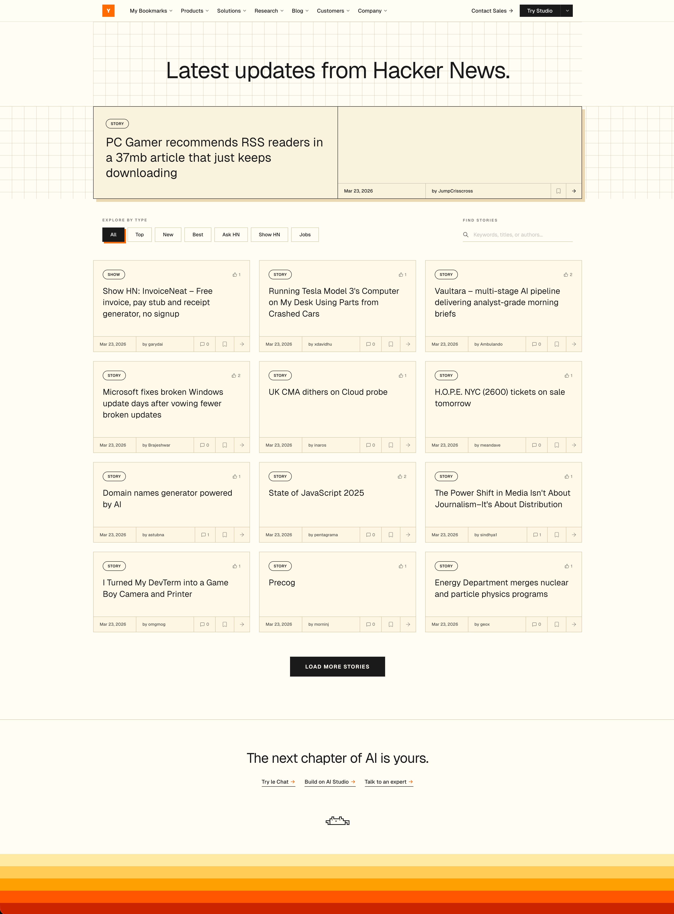
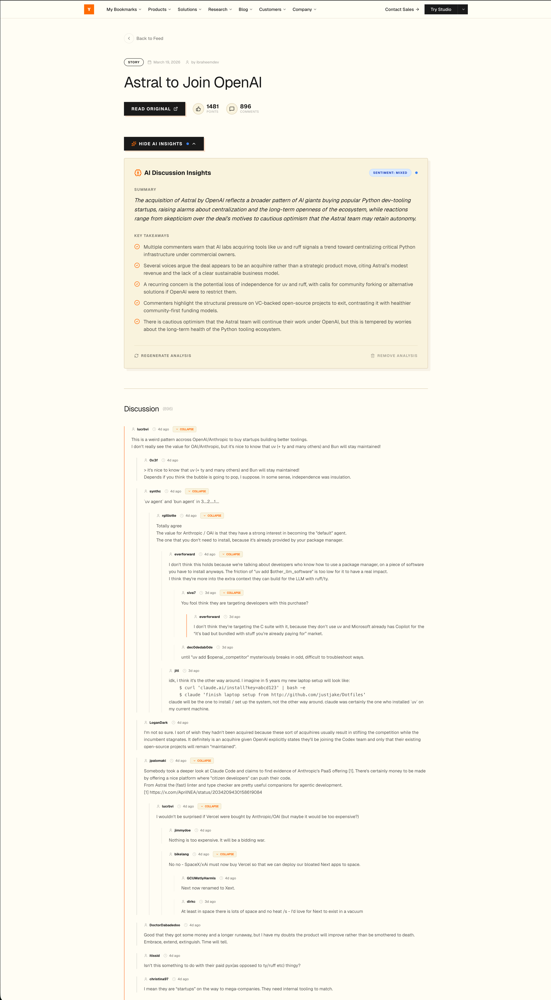
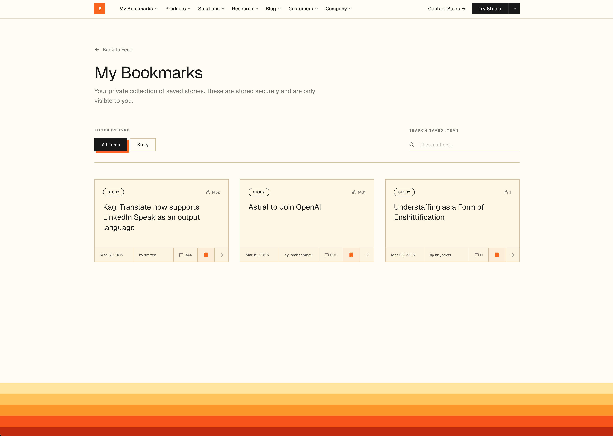

<div align="center">


# 🧠 Dev Monks — AI-Powered Hacker News Reader

**A modern, beautifully designed Hacker News reader with AI-powered discussion summarization.**  
Browse top stories, save bookmarks, and let an AI agent distill thousands of comments into structured, actionable insights — all in one sleek interface.

[🚀 Quick Start](#-getting-started) • [🏗️ Architecture](#️-architecture--system-design) • [🤖 AI Agent](#-the-ai-summarization-agent) • [📦 Tech Stack](#-tech-stack) • [🗂️ Data Modeling](#️-data-modeling-deep-dive) • [🔮 Roadmap](#-future-improvements)

---

> **One-command setup:**
> ```bash
> docker compose up --build
> ```
> Then open [http://localhost:3000](http://localhost:3000)

</div>

---

## 📋 Table of Contents

- [✨ Features](#-features)
- [📦 Tech Stack](#-tech-stack)
- [🏗️ Architecture & System Design](#️-architecture--system-design)
- [🔄 Data Flow](#-data-flow)
- [🗂️ Data Modeling Deep-Dive](#️-data-modeling-deep-dive)
- [🤖 The AI Summarization Agent](#-the-ai-summarization-agent)
- [🚀 Getting Started](#-getting-started)
- [🧠 Approach & Design Decisions](#-approach--design-decisions)
- [⚖️ Tradeoffs](#️-tradeoffs)
- [🔮 Future Improvements](#-future-improvements)
- [📁 Project Structure](#-project-structure)

---

## ✨ Features

| Feature | Description |
|---|---|
| 📰 **Live Story Feed** | Real-time Hacker News top/new/best stories with infinite scroll |
| 🔖 **Instant Bookmarks** | Save stories frictionlessly with zero sign-up required |
| 🤖 **AI Discussion Summarization** | One-click AI summary of comment threads with key points & sentiment |
| ⚡ **Optimistic UI** | Instant visual feedback with automatic rollback on errors |
| 🔁 **Durable Background Jobs** | AI pipeline with automatic retries and step-based checkpointing |
| 🧩 **Shared AI Intelligence** | Summaries are computed once and shared across all users |
| 📱 **Responsive Design** | Tailwind CSS-powered layout with Framer Motion animations |
| 🐳 **One-Command Deployment** | Full stack via Docker Compose — no manual setup required |

---

## 📸 Screenshots

<div align="center">

### Home Feed


### Story Discussion & AI Summary


### Personal Bookmarks


</div>

---

---

## 📦 Tech Stack

| Layer | Technology | Why We Chose It |
|---|---|---|
| **Framework** | [Next.js 16](https://nextjs.org/) (App Router) | Server Components, Server Actions, and API Routes all in one — no separate backend needed |
| **Language** | TypeScript | End-to-end type safety across client, server, and database |
| **Database** | PostgreSQL 16 + [Prisma 7](https://www.prisma.io/) | Reliable relational DB with type-safe ORM, migrations, and connection pooling |
| **Data Source** | [Algolia HN Search API](https://hn.algolia.com/api) | Fetches full comment trees in a **single request** — 10–20× faster than the official Firebase API |
| **AI Engine** | [OpenRouter](https://openrouter.ai/) (`nvidia/nemotron-3-nano`) | Free-tier LLM with structured JSON output and strong technical reasoning |
| **Background Jobs** | [Inngest](https://www.inngest.com/) | Durable, step-based functions with automatic retries, observability, and no infra to manage |
| **State Management** | [React Query (TanStack)](https://tanstack.com/query) | Server state caching, infinite scroll, and optimistic mutations out of the box |
| **Styling** | Tailwind CSS 4 | Utility-first CSS with a custom design system and zero runtime cost |
| **Animations** | [Framer Motion](https://www.framer.com/motion/) | Smooth page transitions, micro-interactions, and gesture support |
| **Icons** | [Lucide React](https://lucide.dev/) | Consistent, tree-shakeable, lightweight icon library |
| **Containerization** | Docker + Docker Compose | Single command to spin up app + Postgres + Inngest Dev Server |

---

## 🏗️ Architecture & System Design

Dev Monks is a **monolithic Next.js app** that integrates external services for AI and job orchestration, with a containerized Postgres database. All services run inside Docker Compose for local development.

```
┌────────────────────────────────────────────────────────────────────┐
│                         DOCKER COMPOSE                             │
│                                                                    │
│  ┌──────────────────────────────────────────────────────────────┐  │
│  │                    Next.js App  (:3000)                      │  │
│  │                                                              │  │
│  │  ┌─────────────────┐  ┌────────────────┐  ┌──────────────┐  │  │
│  │  │  App Router      │  │  API Routes    │  │Server Actions│  │  │
│  │  │  (SSR Pages)     │  │  /api/*        │  │ (Bookmarks)  │  │  │
│  │  └────────┬─────────┘  └───────┬────────┘  └──────┬───────┘  │  │
│  │           │                    │                   │          │  │
│  │  ┌────────▼────────────────────▼───────────────────▼────────┐ │  │
│  │  │                   Shared Libraries                       │ │  │
│  │  │   hn-api.ts │ ai-service.ts │ prisma.ts │ data.ts        │ │  │
│  │  └────────┬───────────────┬────────────────────┬────────────┘ │  │
│  └───────────┼───────────────┼────────────────────┼──────────────┘  │
│              │               │                    │                  │
│  ┌───────────▼──┐  ┌─────────▼─────┐  ┌──────────▼──────────────┐  │
│  │ Algolia HN   │  │  OpenRouter   │  │      PostgreSQL          │  │
│  │ Search API   │  │  (LLM / AI)   │  │        (:5432)           │  │
│  │  (External)  │  │  (External)   │  │  ┌─────────────────────┐ │  │
│  │              │  │               │  │  │  Bookmarks Table    │ │  │
│  └──────────────┘  └───────────────┘  │  │  Summaries Table    │ │  │
│                                       │  └─────────────────────┘ │  │
│                                       └─────────────────────────────┘  │
│                                                                    │
│  ┌─────────────────────────────────────────────────────────────┐  │
│  │               Inngest Dev Server  (:8288)                   │  │
│  │               Background Job Orchestrator                   │  │
│  │                                                             │  │
│  │   ┌─────────────────────────────────────────────────────┐  │  │
│  │   │          summarize-discussion (Durable Fn)          │  │  │
│  │   │                                                     │  │  │
│  │   │   Step 1 ──► Check DB for existing summary         │  │  │
│  │   │   Step 2 ──► Fetch story metadata from Algolia     │  │  │
│  │   │   Step 3 ──► Fetch & flatten comment tree          │  │  │
│  │   │   Step 4 ──► Send to OpenRouter LLM               │  │  │
│  │   │   Step 5 ──► Upsert result to PostgreSQL           │  │  │
│  │   └─────────────────────────────────────────────────────┘  │  │
│  └─────────────────────────────────────────────────────────────┘  │
└────────────────────────────────────────────────────────────────────┘
```

### Key Components

| Component | File(s) | Responsibility |
|---|---|---|
| **Home Feed** | `app/page.tsx` | Infinite-scroll story listing with React Query |
| **Story Detail** | `app/story/[id]/` | Full comment tree + AI summary trigger |
| **Bookmarks Page** | `app/bookmarks/` | Saved story list with snapshot data |
| **Story API** | `api/stories/` | Paginated feed, featured story, and summarize endpoints |
| **Inngest Endpoint** | `api/inngest/` | Webhook receiver for background job events |
| **Server Actions** | `actions/bookmarks.ts` | Toggle, list, and check bookmark state |
| **Summarize Function** | `inngest/summarize-discussion` | 5-step durable AI pipeline |
| **Prisma Models** | `prisma/schema.prisma` | `Bookmark` + `Summary` with composite constraints |

---

## 🔄 Data Flow

### 1. 📖 Story Browsing (Read Path)

```
User visits page
  └─► React Query (useStories hook)
        └─► GET /api/stories?type=top&page=0
              └─► Algolia HN Search API
                    └─► Returns stories + metadata (author, score, comments count, url)
  └─► Cached in React Query (stale: 2min, GC: 10min)
  └─► Rendered with virtual infinite scroll pagination
```

### 2. 🤖 AI Summarization (Write Path)

```
User clicks "Summarize Discussion"
  └─► POST /api/stories/[id]/summarize
        └─► Triggers Inngest event: "story/summarize.requested"
              ├─► Step 1: Query DB — return instantly if summary exists
              ├─► Step 2: Fetch story from Algolia
              ├─► Step 3: Flatten comment tree (max 200 comments, depth 3)
              ├─► Step 4: Prompt OpenRouter LLM → structured JSON response
              └─► Step 5: Upsert Summary into PostgreSQL

  Meanwhile: UI polls GET /api/stories/[id]/summarize every 2 seconds
    └─► Displays <AISummaryCard> with key points once available
```

### 3. 🔖 Bookmarking (Optimistic Write Path)

```
User clicks bookmark icon
  └─► BookmarkContext applies optimistic state update (instant UI)
        └─► Server Action: toggleBookmark(storyId)
              ├─► Prisma: Check existing → Create or Delete record
              ├─► Stores metadata snapshot (title, url, score, author, time)
              └─► Revalidates: /, /bookmarks, /story/[id]
        └─► On error: Rollback optimistic state automatically
```

---

## 🗂️ Data Modeling Deep-Dive

The schema is intentionally lean — designed for **performance**, **cross-user AI sharing**, and **per-user personalization without auth complexity**.

### 1. 🪪 Anonymous User Strategy

Instead of a full authentication system, Dev Monks uses a **cookie-based anonymous user ID**:

- On first visit, a unique `userId` UUID is generated and stored in a **secure, HTTP-only cookie**.
- `Bookmark` records use a composite unique constraint: `@@unique([storyId, userId])`, ensuring each user has independent bookmarks without a user table.
- **Zero friction:** Users get persistent bookmarks instantly, with a clear upgrade path to real accounts later (just replace the cookie ID with an authenticated user ID).

### 2. 📸 The Bookmark Snapshot Pattern

When a story is bookmarked, we don't just store a foreign key. We capture a **point-in-time snapshot** of the story's metadata:

```
Bookmark {
  id          String   @id
  storyId     String
  userId      String   (from cookie)
  title       String   ← snapshot
  url         String?  ← snapshot
  score       Int      ← snapshot
  author      String   ← snapshot
  time        DateTime ← snapshot
  createdAt   DateTime @default(now())
  @@unique([storyId, userId])
}
```

**Why?** HN stories can be flagged, deleted, or modified at any time. Snapshots ensure bookmarks remain stable and readable even if the upstream data changes or disappears.

### 3. 🧠 The Summary Cache Model

```
Summary {
  id          String   @id
  storyId     String   @unique   ← one summary per story, globally
  title       String
  overview    String
  keyPoints   Json     ← stored as JSON array for structured rendering
  sentiment   String
  createdAt   DateTime @default(now())
  updatedAt   DateTime @updatedAt
}
```

Key design decisions:
- **`storyId` is a unique index** — only one AI summary is ever generated per story.
- **Shared intelligence** — because AI analysis of technical discussions is objective, all users share the same summary. If User A triggers it, User B sees it instantly for free.
- **`keyPoints` as JSON** — enables the UI to render structured bullet points rather than parsing plain text.
- **Upsert on write** — prevents duplicate summaries even if multiple users click "Summarize" simultaneously.

---

## 🤖 The AI Summarization Agent

The AI agent isn't a simple API call — it's a **Durable Agentic Workflow** built on Inngest with a strict analytical persona.

### 1. 🎭 The "Elite Analyst" Persona

The agent is configured via a carefully engineered **system prompt** that defines its role as an *Elite Hacker News Analyst*:

- **Mission:** Extract technical signal from social noise.
- **Directives:**
  - Identify contrarian and dissenting viewpoints
  - Map technical debates and unresolved disagreements
  - Answer "The So What?" — why this discussion matters to engineers
  - Call out hype vs. substance
- **Constraints:**
  - Temperature `0.1` for high determinism and consistency
  - Strict JSON output schema to prevent UI breakage
  - Hard cap on tokens to stay within context windows

### 2. ⚙️ Durable Execution with Inngest

AI pipelines fail — networks time out, LLMs rate-limit, databases hiccup. **Inngest** makes the pipeline resilient:

| Feature | Benefit |
|---|---|
| **Step-based execution** | Each step is independently retried on failure — a failed DB write doesn't re-run the LLM |
| **Automatic retries** | Exponential backoff on transient failures (network errors, rate limits) |
| **Event-driven trigger** | Decoupled from the HTTP request — the UI doesn't wait for the LLM |
| **Observability dashboard** | Real-time job status, step-by-step logs at `localhost:8288` |
| **Idempotency** | Safe to trigger the same summary multiple times — Step 1 exits early if it already exists |

### 3. 🔢 The 5-Step Agent Pipeline

```
┌─────────────────────────────────────────────────────────────┐
│                  summarize-discussion                        │
│                                                              │
│  ① IDEMPOTENCY CHECK                                        │
│     └─► Query DB for storyId → return cached if found       │
│                                                              │
│  ② CONTEXT ASSEMBLY                                         │
│     └─► Algolia: fetch story + full comment tree            │
│     └─► Flatten nested comments (max depth: 3)              │
│     └─► Truncate to top 200 comments (95% of signal)        │
│                                                              │
│  ③ SANITIZATION                                             │
│     └─► Handle orphan stories (0 comments)                  │
│     └─► Generate graceful "No discussion yet" notice        │
│                                                              │
│  ④ LLM ORCHESTRATION                                        │
│     └─► System prompt: Elite Analyst persona                │
│     └─► User prompt: formatted story + flattened comments   │
│     └─► OpenRouter (nvidia/nemotron-3-nano)                 │
│     └─► Structured JSON: { overview, keyPoints[], sentiment }│
│                                                              │
│  ⑤ PERSISTENCE                                             │
│     └─► Upsert Summary into PostgreSQL                      │
│     └─► UI polling resolves → AISummaryCard renders         │
└─────────────────────────────────────────────────────────────┘
```

---

## 🚀 Getting Started

### Prerequisites

- [Docker Desktop](https://www.docker.com/products/docker-desktop/) v20+
- [Docker Compose](https://docs.docker.com/compose/) (included with Docker Desktop)
- An [OpenRouter API Key](https://openrouter.ai/keys) (free tier is sufficient)

---

### 🐳 Option 1: Docker (Recommended)

The fastest way to run the full stack — app, database, and Inngest — in one command.

```bash
# 1. Clone the repository
git clone <repo-url>
cd dev-monks

# 2. Configure environment variables
cp .env.example .env
# Open .env and set OPENROUTER_API_KEY

# 3. Start all services
docker compose up --build

# 4. Visit the app
open http://localhost:3000

# 5. (Optional) Inngest job dashboard
open http://localhost:8288
```

> **Note:** Story browsing, search, and bookmarks work **without** an `OPENROUTER_API_KEY`. Only the AI summarization feature requires it.

---

### 💻 Option 2: Local Development

For faster iteration without Docker.

```bash
# 1. Install dependencies
npm install

# 2. Set up environment variables
cp .env.example .env
# Set DATABASE_URL (your local Postgres) and OPENROUTER_API_KEY

# 3. Set up the database
npx prisma generate
npx prisma migrate deploy

# 4. Start the Next.js dev server
npm run dev

# 5. (Optional) Start the Inngest dev server for AI background jobs
npx inngest-cli@latest dev -u http://localhost:3000/api/inngest
```

---

### 🔑 Environment Variables

| Variable | Required | Description |
|---|---|---|
| `DATABASE_URL` | ✅ | PostgreSQL connection string |
| `OPENROUTER_API_KEY` | ⚠️ AI only | Your OpenRouter API key (free at openrouter.ai) |
| `INNGEST_EVENT_KEY` | Docker only | Set automatically by Docker Compose |
| `INNGEST_SIGNING_KEY` | Docker only | Set automatically by Docker Compose |

---

## 🧠 Approach & Design Decisions

### Why Algolia HN API Instead of the Official Firebase API?

The official HN Firebase API requires **one HTTP request per item**. A story with 500 comments requires 500+ sequential roundtrips — at ~50ms each, that's 25+ seconds of latency.

Algolia's Search API returns the **entire comment tree in a single request**, making it:
- **10–20× faster** for page loads
- **Essential** for AI summarization (we need all comments at once to pass to the LLM)
- The only viable approach for a smooth UX

The minor tradeoff is a slight indexing delay vs. real-time Firebase data.

---

### Why Inngest for Background Jobs?

LLM calls are **slow, failure-prone, and expensive to re-run**. A naive implementation inside a Next.js API route would:
- Time out on Vercel (60s limit)
- Lose progress on any network failure
- Re-run expensive LLM calls on retries

Inngest provides step-based checkpointing: if Step 4 (LLM call) succeeds but Step 5 (DB write) fails, only Step 5 is retried — not the LLM call. This makes the pipeline both reliable and cost-efficient.

---

### Why OpenRouter with `nvidia/nemotron-3-nano`?

- **Free tier** — no cost for experimentation and evaluation
- **JSON mode** — structured output prevents UI breakage
- **OpenRouter abstraction** — trivial to swap to Claude 3.5, GPT-4o, or Gemini via a one-line model ID change
- **Sufficient quality** for technical comment summarization

---

### Why Anonymous Cookie-Based Auth?

OAuth adds signup friction that kills conversion for "save for later" features. Cookie-based anonymous IDs give users:
- **Instant bookmarks** on first visit with zero sign-up
- **Session-persistent** saves tied to their browser
- A **clear migration path** — replace the cookie ID with an authenticated user ID when adding NextAuth

---

### Why Prisma with `@prisma/adapter-pg`?

- **Type-safe queries** with full TypeScript inference
- **Migration system** that works identically in Docker, local Postgres, and cloud providers (Neon, Railway, Supabase)
- **Connection pooling** via `pg` adapter, avoiding Serverless cold-start connection exhaustion

---

## ⚖️ Tradeoffs

| Decision | ✅ Benefit | ⚠️ Cost |
|---|---|---|
| **Algolia API over Firebase** | 10–20× faster story + comment fetching | Slight indexing delay vs. real-time Firebase |
| **Free LLM (nemotron-3-nano)** | Zero AI cost for evaluation | Lower quality vs. GPT-4o or Claude 3.5; rate limits under load |
| **Cookie-based anonymous auth** | Zero-friction bookmarking; no sign-up required | No cross-device sync; easy to lose on cookie clear |
| **Next.js Server Components** | Great SEO, faster initial page load, no client JS bloat | Requires careful `"use client"` boundary management for interactivity |
| **Inngest for background jobs** | Durable retries, observability, step checkpointing | Additional service dependency; adds Docker Compose complexity |
| **Optimistic UI for bookmarks** | Instant visual feedback even before DB write | Requires rollback logic and error handling |
| **Snapshot pattern for bookmarks** | Stable bookmarks even if HN story is deleted/flagged | Slightly stale data if a story's score/title changes significantly |
| **Shared AI summaries** | Cost-efficient; instant for subsequent users | Summary is computed once — doesn't update as the discussion grows |

---

## 🔮 Future Improvements

- 🔐 **Authentication** — Add NextAuth.js for cross-device bookmark syncing and user accounts
- ⚡ **Real-time Updates** — WebSocket or SSE for live score and comment count updates
- 🚀 **Redis Caching** — Cache hot summaries and story feeds to reduce DB + Algolia load
- 🧠 **Better AI Models** — One-line swap to Claude 3.5 Sonnet or GPT-4o via OpenRouter
- 🔍 **Full-Text Search** — Search across bookmarks and AI-generated summaries
- 🌙 **Dark Mode** — User-selectable theme with `next-themes`
- 🧪 **Testing** — E2E tests with Playwright and Inngest failure simulation
- 📊 **Analytics** — Track which stories get summarized most, summary quality feedback
- 🔔 **Notifications** — Alert users when a summary is ready (email or browser push)
- 📤 **Export** — Export bookmarks and summaries to Markdown, Notion, or Obsidian

---

## 📁 Project Structure

```
dev-monks/
│
├── 🐳 docker-compose.yml          # Multi-service orchestration (app + postgres + inngest)
├── 🐳 Dockerfile                  # Multi-stage production build
│
├── prisma/
│   ├── schema.prisma              # DB schema — Bookmark & Summary models
│   └── migrations/                # Version-controlled migration history
│
├── scripts/
│   └── docker-entrypoint.sh       # DB readiness check + auto-migration on startup
│
└── src/
    ├── app/
    │   ├── page.tsx               # 🏠 Home feed — infinite scroll story listing
    │   ├── story/[id]/            # 📄 Story detail — full comment tree + AI summary
    │   ├── bookmarks/             # 🔖 Saved stories page
    │   ├── actions/
    │   │   └── bookmarks.ts       # ⚡ Server Actions — toggle, list, check bookmarks
    │   └── api/
    │       ├── stories/           # 📡 REST endpoints — feed, featured, summarize
    │       └── inngest/           # 🔁 Inngest webhook receiver
    │
    ├── components/
    │   ├── hn/                    # 🧩 Domain components (PostCard, Comment, SummarizeButton, AISummaryCard)
    │   ├── layout/                # 🎨 Layout (Navbar, Hero, Footer)
    │   └── ui/                    # 🔧 Reusable UI (Skeletons, ErrorAlert, Icons)
    │
    ├── context/
    │   └── BookmarkContext.tsx    # 🗃️ Global bookmark state with optimistic updates
    │
    ├── cookies/                   # 🍪 Anonymous user ID generation & retrieval
    ├── hooks/
    │   └── useStories.ts          # 🪝 React Query hook — infinite paginated story feed
    │
    ├── inngest/
    │   └── summarize-discussion.ts # 🤖 5-step durable AI summarization function
    │
    ├── lib/
    │   ├── hn-api.ts              # 🌐 Algolia HN API client
    │   ├── ai-service.ts          # 🧠 OpenRouter LLM integration
    │   └── prisma.ts              # 🗄️ Prisma client singleton
    │
    ├── types/                     # 📐 TypeScript type definitions
    └── utils/                     # 🛠️ Helpers — date formatting, text truncation, HTML sanitization
```

---

<div align="center">

**Built with ❤️ by Dev Monks**

*If this project helped you, please consider giving it a ⭐ on GitHub!*

</div>